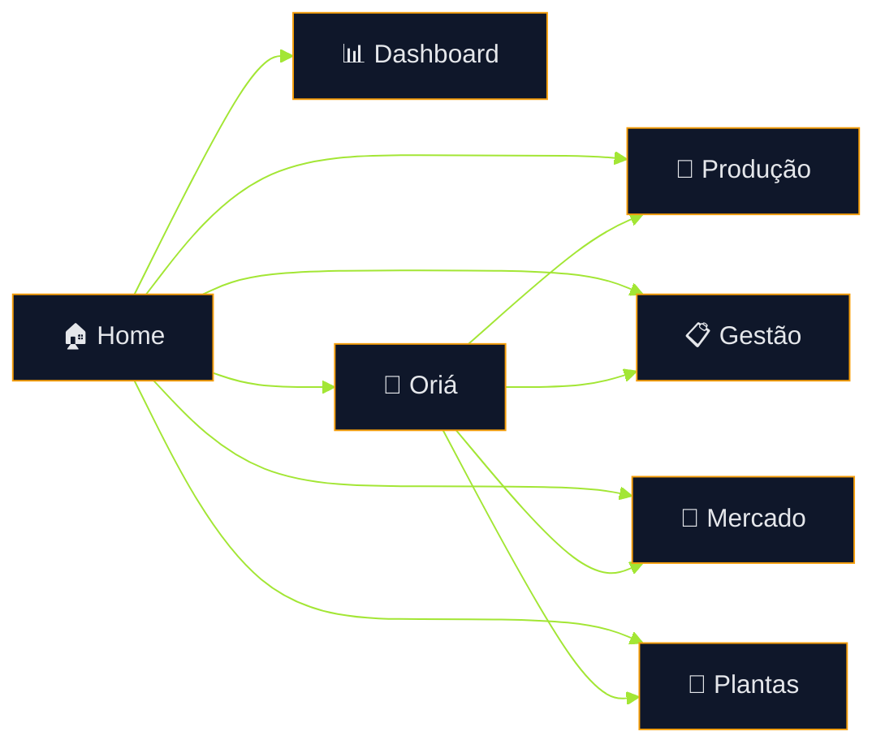

# 🌿 Terra Conecta
## Documento Executivo Estratégico

> Plataforma digital para assistência técnica contínua, gestão produtiva e conexão comercial de agricultoras familiares.

---

# 1. Propósito

O **Terra Conecta** nasce para resolver um problema recorrente: a distância entre a orientação técnica necessária no campo e a rotina real de quem produz.

Em muitos cenários, a produtora precisa decidir sozinha sobre plantio, manejo, colheita, organização da produção, venda e entrega. O sistema reduz essa lacuna com uma experiência simples, visual e contínua.

---

# 2. Como a Plataforma Funciona

O produto organiza a jornada em quatro eixos integrados:

| Eixo | Papel |
|---|---|
| 🌱 Produção | Apoia o trabalho dentro do quintal |
| 📋 Gestão | Organiza rotina, registros e perdas |
| 🛒 Mercado | Leva a produção para venda |
| 🤖 Oriá | Assistente inteligente transversal |

---

# 3. Fluxo Geral da Usuária

### Leitura do fluxo
- A **Home** é a porta de entrada.
- Cada módulo resolve uma etapa prática.
- A **Oriá** pode ser acionada em qualquer momento.
- O sistema privilegia decisões rápidas e execução simples.

---

# 4. Porteira para Dentro — Produção

Tudo que acontece no cultivo e na preparação da produção.

## O que a usuária encontra
- Planejamento de plantio
- Calendário produtivo
- Manejo
- Irrigação
- Colheita
- Checklist diário
- Alertas preventivos
- Acompanhamento visual

## Exemplo real de uso
1. A produtora abre Produção  
2. Marca tarefas concluídas  
3. Vê pendências do dia  
4. Recebe orientação da Oriá  
5. Segue para colheita organizada

## Resultado
- Menos improviso  
- Mais produtividade  
- Redução de perdas no processo

---

# 5. Gestão Simplificada

Transforma rotina em controle simples.

## Funções
- Registrar o que foi plantado
- Registrar colheita
- Acompanhar andamento
- Identificar gargalos
- Evitar perdas
- Salvar observações

## Lógica da tela
- Indicadores visuais
- Checklist tocável
- Percentual de avanço
- Bloco de anotações

## Benefício
A usuária deixa de depender da memória e passa a operar com clareza.

---

# 6. Porteira para Fora — Mercado

Conecta produção e renda.

## Funções
- Preparar feira
- Venda institucional
- Separar pedidos
- Organizar entregas
- Ver estimativa de renda
- Acompanhar status comercial

## Jornada comercial

## Resultado
- Melhor escoamento
- Mais previsibilidade financeira
- Expansão de canais de venda

---

# 7. Oriá — Assistente Rural

A **Oriá** é a camada de inteligência e suporte humano-digital do sistema.

## Entradas
- 🎤 Voz
- 💬 Texto
- 📷 Foto

## Saídas
- Orientação objetiva
- Resposta falada
- Próxima ação recomendada
- Direcionamento para módulo correto

## Exemplos
- “Minha planta está secando”
- “O que entregar hoje?”
- “Quanto posso vender?”
- “O que falta fazer agora?”

## Papel Estratégico
A Oriá reduz barreiras tecnológicas e simplifica o uso da plataforma inteira.

---

# 8. Dashboard Operacional

Tela de visão rápida.

## Mostra
- Alertas
- Pendências
- Atividades recentes
- Percentuais
- Indicadores do dia

## Objetivo
Permitir que a usuária entenda a situação atual em segundos.

---

# 9. UX e Inclusão Digital

O produto foi desenhado para uso real em campo.

## Princípios
- Botões grandes
- Ícones intuitivos
- Pouco texto
- Cores por função
- Navegação direta
- Mobile first
- Feedback visual imediato

## Impacto
Mesmo pessoas com baixa familiaridade digital conseguem operar com autonomia.

---

# 10. Arquitetura Técnica

## Base Atual
- React
- TypeScript
- Estrutura modular
- Componentes reutilizáveis
- Evolução incremental

## Estratégia
Sem superengenharia inicial. O sistema cresce por etapas validadas.

## Evolução futura
- Backend real
- Login
- Multiusuário
- Analytics
- Integrações públicas
- IA avançada

---

# 11. Impacto Esperado

## Econômico
- Mais renda
- Menos perdas
- Melhor organização comercial

## Social
- Inclusão digital
- Autonomia produtiva
- Fortalecimento local
- Tecnologia replicável

---

# 12. Conclusão

O **Terra Conecta** é mais que software.  
É uma estrutura prática para transformar rotina produtiva em resultado econômico, com simplicidade, suporte contínuo e potencial real de escala.
