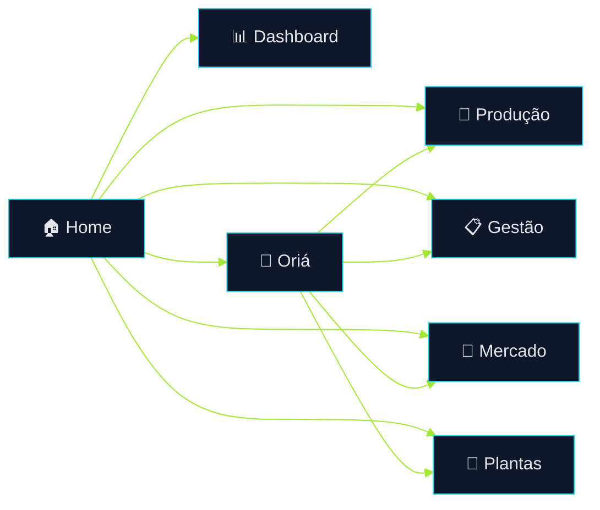

# 🌿 Terra Conecta
## Documento Executivo Expandido

> Plataforma digital de assistência técnica contínua, gestão produtiva e conexão comercial para agricultoras familiares beneficiárias de Quintais Produtivos.

---

# 1. Contexto Estratégico

O fortalecimento da agricultura familiar depende não apenas de produção, mas de acesso contínuo à informação, organização operacional e capacidade de comercialização.

Na prática, muitas produtoras precisam decidir diariamente sobre plantio, irrigação, manejo, colheita, separação de produtos, vendas e entregas sem suporte técnico frequente e sem ferramentas simples de gestão.

O **Terra Conecta** surge para preencher essa lacuna com uma plataforma digital acessível, visual e orientada à rotina real do campo.

Seu papel é transformar tarefas complexas em ações claras, simples e executáveis.

---

# 2. Proposta de Valor

O sistema integra, em uma única experiência digital:

- assistência técnica simplificada  
- organização produtiva  
- apoio à comercialização  
- inteligência assistida com Oriá  
- acompanhamento visual da operação  
- estímulo à geração de renda  

Isso reduz fricção operacional e aproxima tecnologia de quem realmente produz.

---

# 3. Estrutura Geral da Plataforma

O produto foi desenhado em módulos complementares, cada um responsável por uma parte concreta da jornada da usuária.

| Módulo | Responsabilidade |
|---|---|
| 🏠 Home | Entrada principal e navegação simples |
| 🌱 Produção | Apoio ao cultivo e rotina produtiva |
| 📋 Gestão | Registros, controle e prevenção de perdas |
| 🛒 Mercado | Venda, entregas e renda |
| 🌿 Plantas | Apoio visual e diagnóstico orientativo |
| 📊 Dashboard | Visão rápida da operação |
| 🤖 Oriá | Assistente transversal da plataforma |

---

# 4. Fluxo Integrado da Usuária

### Interpretação

A Home concentra atalhos visuais e reduz complexidade de navegação.  
A partir dela, a produtora acessa rapidamente a tarefa que precisa resolver naquele momento.

A Oriá atua como ponte entre dúvida e ação, podendo direcionar a usuária para o módulo correto.

---

# 5. Porteira para Dentro — Produção

Este eixo concentra tudo que acontece dentro da unidade produtiva.

## Principais Funções

- planejamento de plantio  
- calendário de atividades  
- manejo diário  
- irrigação  
- acompanhamento de crescimento  
- colheita organizada  
- checklists operacionais  
- alertas preventivos  

## Como Funciona

A usuária acessa tarefas simples, visualiza prioridades e marca o que foi concluído.  
O sistema transforma uma rotina desorganizada em fluxo claro de execução.

## Exemplo

1. Verificar irrigação  
2. Confirmar etapa de manejo  
3. Organizar colheita do dia  
4. Registrar andamento  
5. Seguir para venda ou armazenamento

## Benefícios

- mais produtividade  
- menor improviso  
- rotina previsível  
- redução de perdas no processo produtivo

---

# 6. Gestão Simplificada

Nem toda produtora possui planilhas, cadernos organizados ou tempo para controles complexos.  
Por isso, a gestão no Terra Conecta foi pensada para ser prática.

## Recursos

- registrar produção  
- acompanhar andamento  
- ver percentuais de avanço  
- identificar pendências  
- salvar observações  
- prevenir perdas  

## Experiência

Ao invés de relatórios complexos, a plataforma apresenta:

- status visual  
- checklist interativo  
- indicadores simples  
- progresso operacional  

## Resultado

Mais clareza sobre o que está acontecendo e melhor capacidade de decisão.

---

# 7. Porteira para Fora — Mercado

Produzir bem não basta. É necessário vender com regularidade.

O módulo Mercado conecta produção e renda.

## Recursos

- preparar feira  
- organizar venda institucional  
- separar pedidos  
- acompanhar entregas  
- visualizar renda estimada  
- acompanhar fluxo comercial

## Fluxo Comercial

## Valor Gerado

- melhora escoamento  
- amplia canais de venda  
- aumenta previsibilidade financeira  
- fortalece renda local

---

# 8. Oriá — Assistente Inteligente

A **Oriá** é o centro de suporte humano-digital da plataforma.

## Entradas Disponíveis

- 🎤 Voz  
- 💬 Texto  
- 📷 Foto  

## Respostas Possíveis

- orientação prática  
- resposta falada  
- próximo passo sugerido  
- redirecionamento para módulo correto  
- apoio contextual à decisão

## Casos Reais

- “Minha planta está amarela”  
- “O que preciso fazer hoje?”  
- “Quanto posso vender?”  
- “Como organizar entrega?”  
- “O que está faltando?”  

## Papel Estratégico

A Oriá reduz barreiras tecnológicas e acelera adoção da plataforma.

---

# 9. Dashboard Operacional

O Dashboard foi criado para leitura rápida.

## Exibe

- alertas importantes  
- tarefas pendentes  
- atividades recentes  
- status geral  
- indicadores rápidos  
- evolução operacional

## Objetivo

Em poucos segundos, a usuária entende sua situação atual e sabe qual ação priorizar.

---

# 10. UX e Inclusão Digital

A plataforma considera realidades diversas de uso.

## Diretrizes

- botões grandes  
- ícones intuitivos  
- pouco texto  
- linguagem direta  
- contraste visual  
- navegação simples  
- mobile first  

## Por que isso importa

Muitas usuárias não têm experiência com sistemas complexos.  
O design precisa ensinar pelo uso, não exigir treinamento longo.

---

# 11. Arquitetura Técnica

## Base Atual

- React  
- TypeScript  
- estrutura modular  
- componentes reutilizáveis  
- crescimento incremental  

## Estratégia Técnica

O sistema evita superengenharia inicial.  
Primeiro entrega valor real, depois evolui com base no uso.

## Possíveis Evoluções

- backend completo  
- autenticação  
- multiusuário  
- analytics  
- integrações governamentais  
- IA ampliada  
- relatórios executivos

---

# 12. Impacto Esperado

## Econômico

- aumento de renda  
- melhor organização comercial  
- menor desperdício  
- previsibilidade operacional  

## Social

- inclusão digital  
- autonomia produtiva  
- fortalecimento comunitário  
- replicabilidade em outros territórios  

## Institucional

- maior capacidade de acompanhamento  
- visão consolidada do projeto  
- base para políticas públicas futuras

---

# 13. Conclusão Executiva

O **Terra Conecta** representa uma tecnologia social moderna, simples de usar e orientada a resultado.

Ele conecta produção, organização e mercado em uma experiência única, com suporte inteligente e potencial concreto de transformação econômica para agricultoras familiares.
